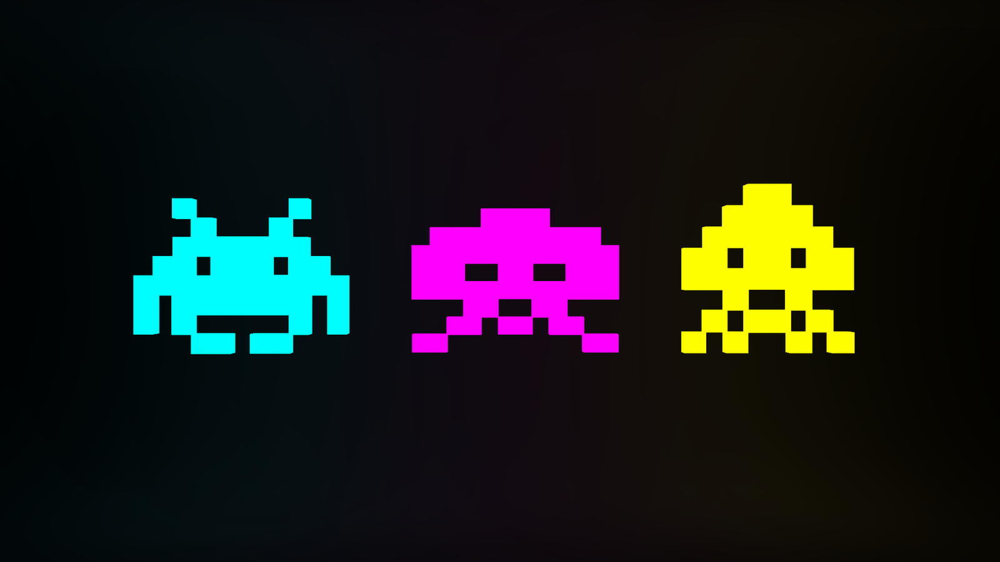

#JSInvaders

A basic implementation of Space Invaders in JavaScript.

I have recently begun converting this to TypeScript and am exploring creative ways to develop the game using modern practices. This project is open to all who wish to contribute! 

##Current
In its current state it works more like Mattel's Astrosmash with a basic game loop, a spaceship at the bottom and some falling blocks. The game loop is present, it handles input and the spaceship can fire at falling blocks. 

There is a branch in progress with a build system using the TypeScript compiler and it adds watch mode.

##Todo
* I have not yet implemented any collision detection.
* I have to incorporate sound. For eg. when the spaceship fires.
* I am working on adding unit tests.
* Better sprite designs would be nice.
* Would love to have a sprite page and a TS/JS function that can cut the page and cycle through elements on the page for animation.
* Better Graphic design! I recently discovered Krita and I'm planning on playing with this to build my custom graphics.
* Custom sounds! I suck at 'Bing'-ing royalty free sounds and/or coming up with my own custom sounds.

(Yes, I use Bing instead of Google! Trying to build up my MSFT points, don't hate!)